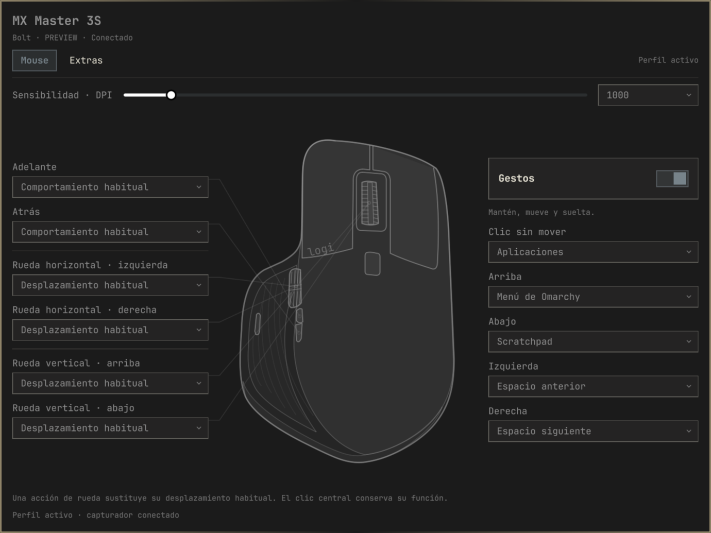

# Omalogi

Logitech mouse controls for Omarchy: configure DPI, gestures, buttons, and scroll wheels through a native desktop panel.

Omalogi adds a mouse widget to the Omarchy bar. Its popup saves and applies changes automatically, verifies device settings, and lets you restore the original configuration. A Rust CLI coordinates the changes; Solaar provides HID++ access and event capture.



Preview rendered with simulated device data in the native Omarchy components.

**Beta compatibility:** MX Master 3S connected through a Logitech Bolt receiver, Omarchy 4.0.4, Quickshell 0.3.1, Hyprland 0.56.2 and Solaar 1.1.20. Other models, Bluetooth and other software versions are not yet validated. A real new-session startup and installation on a second clean machine remain pending; see [VALIDATION.md](VALIDATION.md).

## Features

- DPI from the values reported by the sensor.
- Gesture button click and four directions, plus back/forward button assignments.
- Vertical and horizontal wheel actions, inversion, resolution, ratchet and SmartShift when supported.
- Native Omarchy components, colors and typography.
- Queued automatic application; the panel can close while changes finish in the background.
- Selective persistence, preservation of foreign Solaar rules, rollback and original-state restoration.

The panel and documentation are initially in Spanish. [Detailed usage in Spanish](docs/USAGE.es.md).

## Install from Omarchy Plugins

Once the matching binary release is published:

```bash
omarchy plugin add https://github.com/AlejandroFloresArroyo/omalogi.git
bash "$HOME/.config/omarchy/plugins/omalogi.mouse/scripts/install.sh"
```

The first command installs the plugin files. **Omarchy does not run dependency/build hooks:** the second command installs Solaar if missing, downloads the matching Linux x86_64 binary, verifies its SHA256 checksum, installs the user service and enables the widget.

Run as your desktop user, without `sudo`. Installing Solaar may ask for your password in the terminal. Its Arch package includes Python dependencies and udev rules; reconnect the receiver if device permissions have not been refreshed. The installer accepts only Solaar 1.1.20 for this beta because its fast adapter uses internal Solaar APIs.

If you already run Solaar separately, close that instance before setup. Omalogi runs a single Solaar instance in `omalogi-solaar.service`. It does not replace foreign Solaar rules or change other devices. Installing does not apply a mouse profile; changes begin when you edit the panel.

## Install from source

This path works before the first binary release exists:

```bash
git clone https://github.com/AlejandroFloresArroyo/omalogi.git
cd omalogi
omarchy pkg add rust
bash scripts/install.sh --from-source
```

For an offline build, first run `cargo fetch --locked` while connected, install Solaar, then run `bash scripts/install.sh --from-source --offline`. You can also use an already verified executable with `--binary /absolute/path/omalogi --offline`.

Source installation copies the manifest and QML into the plugin directory. Re-run the installer from the source checkout to update it. This differs from the Git-managed marketplace installation.

## Update and remove

For a Git-managed plugin:

```bash
omarchy plugin update omalogi.mouse
bash "$HOME/.config/omarchy/plugins/omalogi.mouse/scripts/install.sh"
```

Both steps are required: plugin updates do not replace the CLI or service automatically. Use only a plugin revision with a corresponding published binary release. Source installations update with `git pull --ff-only` in their original checkout and another `--from-source` installation.

Uninstall from the checkout used for installation:

```bash
bash scripts/uninstall.sh
```

For a marketplace checkout, the full path is `~/.config/omarchy/plugins/omalogi.mouse/scripts/uninstall.sh`. The script restores the mouse before removing the service, binary and widget. If restoration fails, removal stops so recovery remains available. Solaar, profiles, snapshots and event logs remain on disk. Use this script before `omarchy plugin remove`; that Omarchy command alone does not clean up the backend or restore the mouse.

## Migration from the local MVP

The installer recognizes the previous local installation and migrates its profile, original-state snapshot, operation lock, event logs and widget placement to Omalogi. It updates only the managed rule block's executable path and markers, leaving physical settings and foreign rules intact. A pending transaction, two existing configuration directories, malformed rules or unrelated destination files stop migration before changes.

The old plugin/service/binary are removed after file migration. Backups of the previous installation receipt and desktop configuration remain in `~/.config/omalogi/`. If service startup fails after migration, run the installer again to complete setup.

## CLI and files

```bash
~/.local/bin/omalogi panel
~/.local/bin/omalogi status
~/.local/bin/omalogi doctor
~/.local/bin/omalogi restore
systemctl --user status omalogi-solaar.service
journalctl --user -u omalogi-solaar.service
```

| Component | Location |
| --- | --- |
| CLI | `~/.local/bin/omalogi` |
| Plugin | `~/.config/omarchy/plugins/omalogi.mouse/` |
| Profile, snapshots and logs | `~/.config/omalogi/` |
| User service | `~/.config/systemd/user/omalogi-solaar.service` |
| App launcher | `~/.local/share/applications/omalogi.desktop` |

The current Omarchy plugin CLI discovers plugins under `~/.config`; the installer therefore rejects a custom `XDG_CONFIG_HOME`. The runtime itself honors XDG configuration paths. Nothing is installed into `/usr/share/omarchy`.

## Development and validation

```bash
cargo test --locked
cargo fmt --check
cargo clippy --locked --all-targets -- -D warnings
python3 -m unittest discover -s tests -p 'test_*.py'
python3 scripts/check-distribution.py
omarchy plugin validate .
python3 scripts/test-panel.py
```

Python tests require PyYAML and the compiled debug binary produced by `cargo test`. The native QML regression requires an installed Omarchy/Quickshell session. Simulated tests do not certify physical input, reconnection or login. Historical hardware artifacts stay local and are excluded from the repository.

See [release and marketplace preparation](docs/PUBLISHING.md), [scope](MVP_SCOPE.md) and [changelog](CHANGELOG.md).

## License

Omalogi is MIT licensed. Solaar is an external dependency installed through Arch's package manager; its source is not included. Omalogi is an independent project.
